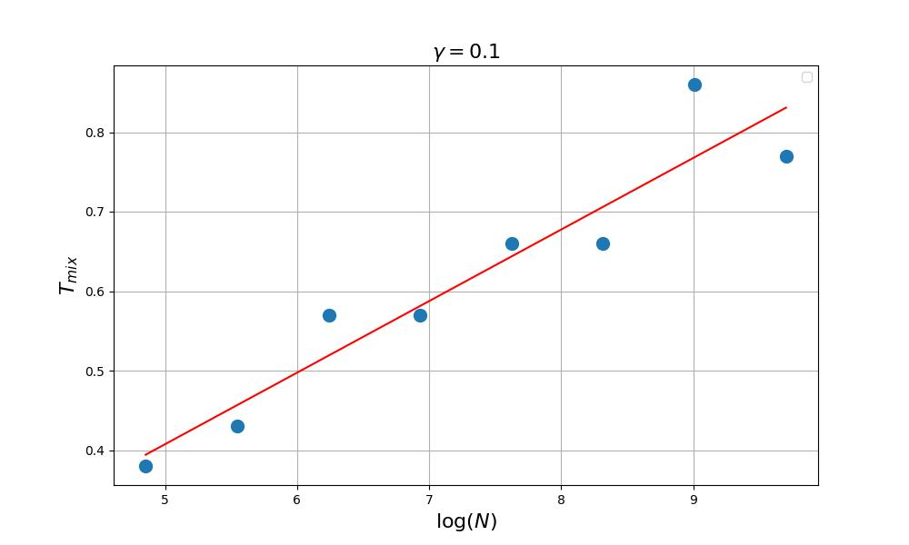
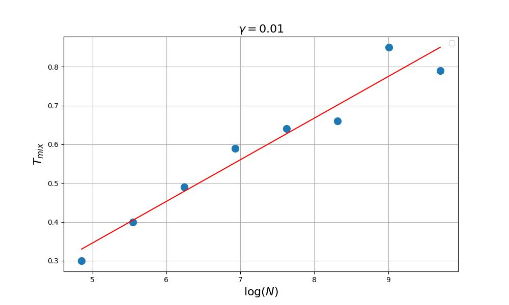
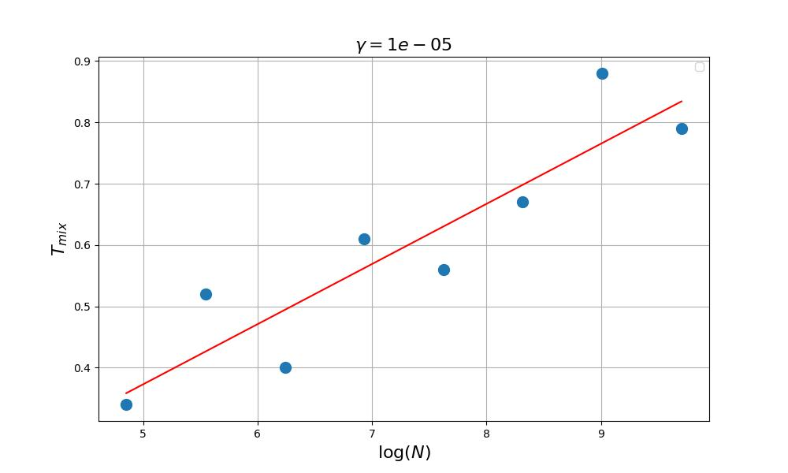

# transport_flows_project

## Проверка закона сходимости методов логит-динамики и динамики наилучших ответов: время достижения равновесного состояния пропорционально логарифму от числа автомобилей 

### Данные могут быть взяты отсюда
https://github.com/bstabler/TransportationNetworks

### Случай логит-динамики

### Случай динамики наилучших решений

- Жолобов Владимир, tg: @VlaDreamer
- Ерлыгин Леонид, tg: @icekingoo
